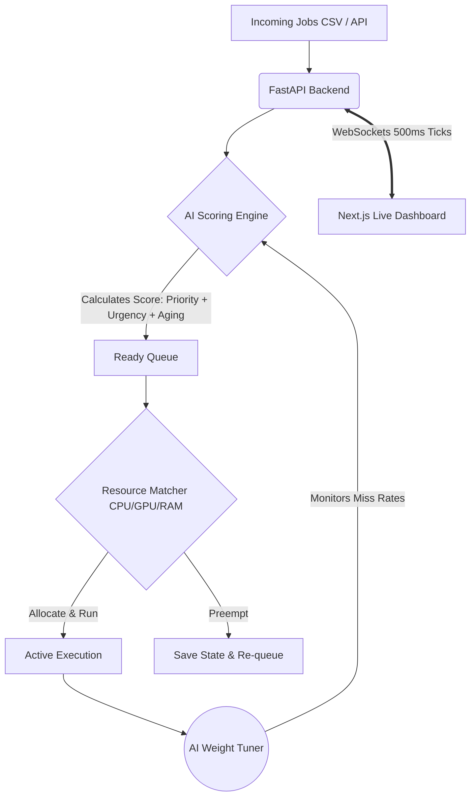

# 🚀 NexScheduler AI

<div align="center">
  
  
  
</div>

<br>

**NexScheduler AI** is an intelligent, real-time job scheduling decision engine built by **Team Doomsday** for SRIJAN. 

It dynamically allocates compute resources (CPU, GPU, RAM) to competing jobs using a multi-factor scoring algorithm—combining urgency, aging, resource efficiency, and priority. Unlike legacy schedulers (FCFS, Round Robin), NexScheduler continuously re-evaluates every job, preempts lower-priority work when critical deadlines approach, and guarantees no job ever starves.

---

## 🌍 Solving Real-World Scheduling Problems

Modern compute clusters (like AWS, hospital networks, or AI data centers) lose millions of dollars due to dumb scheduling. We solve the three biggest real-world bottlenecks:

1. **The SLA Breach Problem:** A data scientist submits a massive 6-hour job that hogs all GPUs. A critical compliance job arrives but is stuck waiting, causing a regulatory fine.
   * **Our Solution:** As the compliance job's deadline approaches, its *Urgency Score* spikes, allowing it to automatically **preempt (pause)** the long-running job.
2. **The Starvation Problem:** Traditional priority schedulers completely ignore low-priority background tasks when under heavy load, leaving them "starved" forever.
   * **Our Solution:** Our algorithm includes an **Aging Bonus**. The longer a job waits, the higher its score becomes, guaranteeing eventual execution.
3. **The Resource Waste Problem:** A job needing 8 CPUs waits for hours because only 6 are available, leaving those 6 CPUs completely idle.
   * **Our Solution:** Our **Resource Efficiency** metric detects available gaps and dynamically slides in smaller, perfectly-fitting jobs to maintain near 100% utilization.

---

## 🏗️ System Architecture

Our system is built as a highly responsive, event-driven Decision Engine:



---

## 🆚 NexScheduler vs. The Market

| Feature | Legacy (FCFS / Round Robin) | Kubernetes Default | AWS Batch | **NexScheduler AI (Ours)** |
| :--- | :---: | :---: | :---: | :---: |
| **Dynamic Priority Recalculation** | ❌ | ❌ | ❌ | ✅ **Every 500ms** |
| **Deadline-Aware Preemption** | ❌ | Partial | ❌ | ✅ **Native** |
| **Guaranteed Starvation Fix** | ❌ | Manual config | ❌ | ✅ **Math-driven (Aging)** |
| **AI Auto-Tuning Weights** | ❌ | ❌ | ❌ | ✅ **Gradient Descent** |
| **Visual Explainability** | ❌ | ❌ | ❌ | ✅ **"Why this job?" Panel** |
| **Live What-If Simulation** | ❌ | ❌ | ❌ | ✅ **Built-in** |

---

## 🎯 The Core IP: Dynamic Priority Score

Instead of static priorities, our engine recalculates a live score for every job:

```text
Dynamic Score = (W1 × Urgency) + (W2 × Aging) + (W3 × Resource Efficiency) + (W4 × Base Priority)
```
* **Urgency:** Spikes as a deadline approaches.
* **Aging:** Linearly grows the longer a job waits (Starvation Guard).
* **Resource Efficiency:** Favors jobs that fit perfectly into currently available CPU/GPU units.
* **AI Optimizer:** Weights (W1-W4) are self-tuned by an online gradient descent agent based on real-time miss rates.

---

## ✨ Key Features
- ⚡ **Real-Time Preemption:** Critical jobs instantly preempt (pause) lower-priority jobs.
- 📁 **CSV Bulk Upload:** Upload realistic workloads instantly to see the scheduler handle 50+ mixed-constraint jobs live.
- 🧠 **Explainability Panel:** Visually explains *why* the scheduler picked a specific job.
- ⚔️ **Algorithm Battle Mode:** Compares NexScheduler vs FCFS vs Round Robin vs Static Priority live on the same workload.

---

## 🛠️ Tech Stack
* **Frontend:** React 18, Next.js, Tailwind, WebSockets
* **Backend:** Python 3.11, FastAPI, Uvicorn, NumPy
* **Data/State:** Redis (In-memory queues)
* **Deployment:** Docker & Docker Compose

---

## 🏃‍♂️ How to Run (Quick Start)

### Option 1: Docker (Recommended)
```bash
git clone https://github.com/9325281535/Doomsday-srijan.git
cd Doomsday-srijan
docker-compose up --build
# Open http://localhost:3000/scheduler
```

### Option 2: Manual Run
**Terminal 1 (Backend):**
```bash
cd backend
pip install -r requirements.txt
uvicorn main:app --host 0.0.0.0 --port 8000 --reload
```
**Terminal 2 (Frontend):**
```bash
cd frontend
npm install
npm run dev
# Go to http://localhost:3000/scheduler
```

---

## 🎬 Built-in Demo Scenarios

The dashboard includes one-click scenarios and a CSV uploader for judges:
1. **📁 Real-World Load:** Upload `demo_jobs.csv` (included in repo) to instantly spawn 55 mixed-constraint jobs.
2. **⚡ Urgent Preemption:** A critical job arrives and immediately kicks out a running job.
3. **🐢 Starvation Fix:** A low-priority job ages up and eventually forces execution.
4. **🖥️ GPU Bottleneck:** Heavy GPU jobs contend, forcing CPU-only jobs to run to maximize throughput.
5. **⚔️ Algorithm Battle:** Evaluates all 4 algorithms and proves NexScheduler achieves the lowest deadline miss rate and highest utilization.

---
<div align="center">
  <i>Built with ❤️ by Team Doomsday for SRIJAN Hackathon Phase 2</i>
</div>